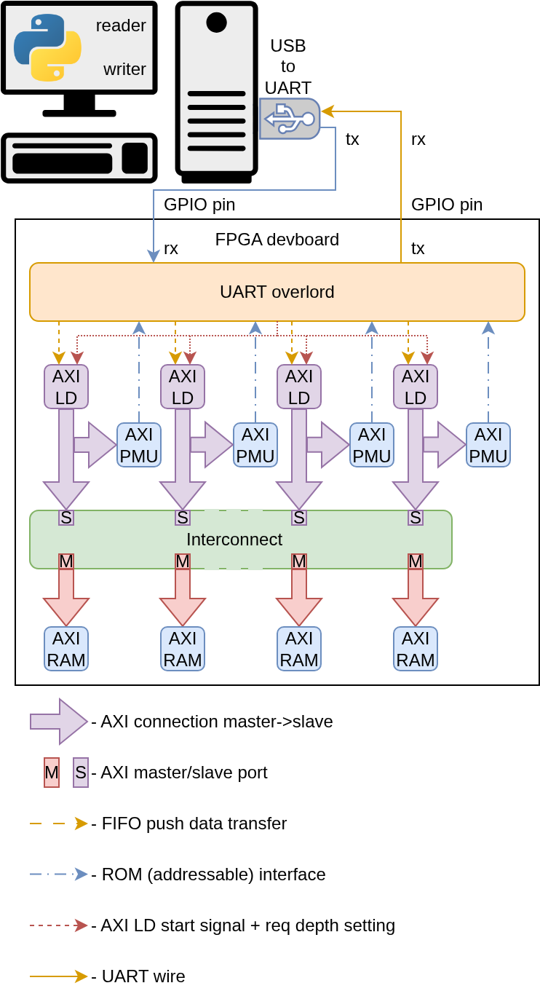
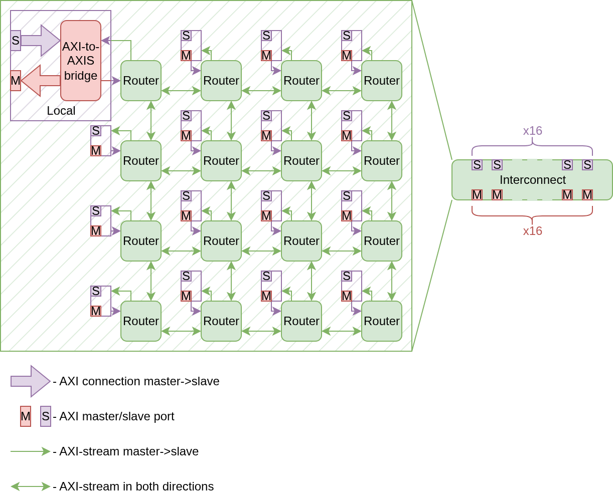
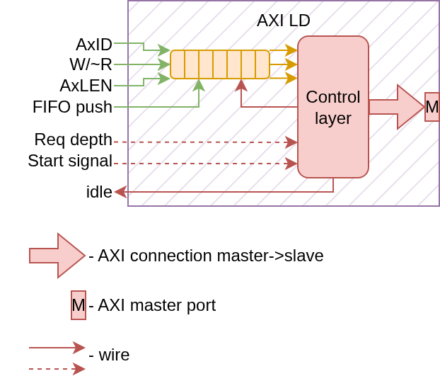
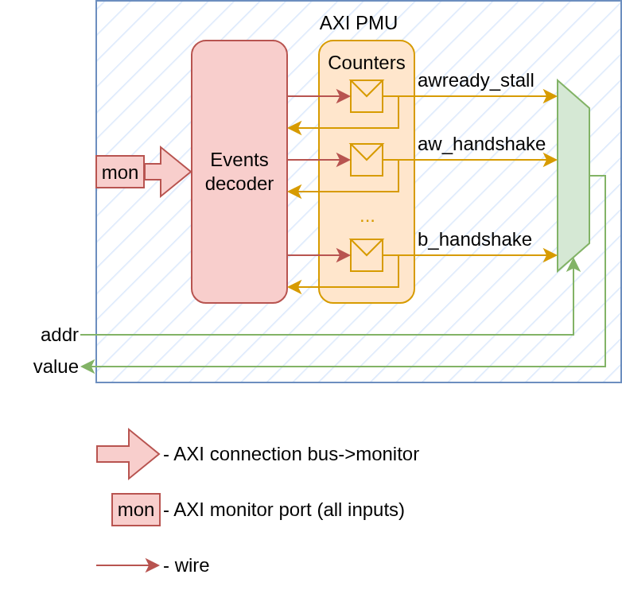
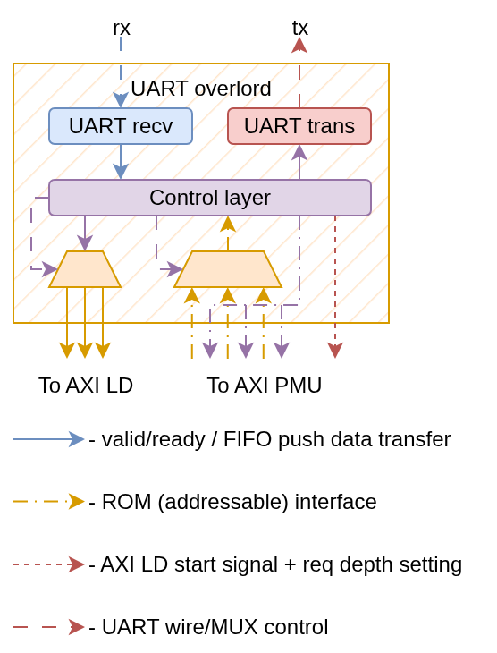

# AXI-NoC-with-PMUs-and-cosim
An open-source and free to use performance measuring framework of AXI-based interconnects using cosimulation principles. Contains a 4x4 mesh NoC, which connects with masters and slaves using AXI, RAM banks (AXI RAM) connected as slaves, programmable AXI-loaders (AXI LD) connected as masters and readable AXI perfoemance metric units (AXI PMU) cutting between AXI LD and interconnect.
All AXI LD and AXI PMU instances are controlled/read by UART overlord, which reads commands from a PC using UART and controls units accordingly.



### Key features
* A 4x4 mesh NoC which uses an XY algorithm and cut-through routing, and has AXI-stream interfaces as connections;
* NoC routers connect to local nodes using an AXI-to-AXIS bridge, which turns a AXI stream interface into a full fledged AXI;
* Uses cosimulation principles to accelerate modelling and performance measurement (FPGA modelling is around 250,000x faster than conventional simulation in my case);
* Uses Questa/cocotb+Questa for simulation;
* Supports Quartus for FPGA synthesis;
* Offers a build system that can be used with a single `make` call with a possibility of more fine tuning;
* Runs on wsl using Ubuntu 22.04, probably runs on most Linux distributions as long as necessary software is installed.

## Repository contents
<pre>
Directiry                      Description

build_system                   Contains a build system allowing icarus/Questa simulation and Quartus compilation using `make`
├ icarus                       Icarus build system (doesn't work for a whole design since it uses a lot of unsupported SystemVerilog syntax)
├ quartus                      Questa build system (main simulation engine for this project)
└ questa                       Quartus build system (for generating FPGA programming files)
cctb                           Cocotb build system (only supports Questa for the purposes of this project)
├ build                        Contains everything for cocotb to work
│   ├ user_requirements.txt    List of other python modules to be installed (conventional requirements.txt style)
│   └ *everything else*        Things that make cocotb work in this project
└ *sim_run*                    Contains a particular simulation run associated with a .py module used for it
data                           Filler directiry for drawing performance graphs depending on the load
doc                            Documentation
python                         Cosimulation scripts (PC side)
├ perpetual_read.py            Perpetually reads UART input and outputs incoming data to the terminal
└ uart_write.py                Write UART data and is used to issue commands to the design on the FPGA
rtl
├ *everything else*            Synthesizable RTL and additional stuff (firmwares and hexes for soft cores, etc.)
├ lists                        Perpetually reads UART input and outputs incoming data to the terminal
│   ├ files_hex.lst            List of all hex files (paths relative to ./rtl/ directory)
│   ├ files_rtl.lst            List of all SystemVerilog files (paths relative to ./rtl/ directory)
│   └ modules_cctb.lst         List of all cocotb testbench python files (paths relative to ./rtl/ directory)
└ tb                           Pure HDL testbenches for Questa and python testbenches with HDL wrappers for cocotb
.gitignore                     .gitignore
README.md                      README.md
</pre>

# Necessary software
* OS - Linux, Windows (for use in WSL2, verified distro - Ubuntu 22.04);
* Intel® Quartus® Prime Lite (verified version - 17.1, [installation guide](https://cdrdv2-public.intel.com/666293/quartus_install-683472-666293.pdf));
* Questa*-FPGAs Standard Edition (verified version - 24.1);

# Using the build system

There are several build systems built in the repository to ease the simulation and FPGA synthesis. All of the
makefiles should be called from the root of the repository.

## Lists
There are three .lst files in ```./rtl/lists/```: ```files_hex.lst```, ```files_rtl.lst```, ```modules_cctb.lst```.
All of them contain a list of paths relative to the ```./rtl/``` directory.
* ```files_hex.lst```: list of all .hex files (memory initialization files);
* ```files_rtl.lst```: list of all Verilog/SystemVerilog files that you want to be compiled;
* ```modules_cctb.lst```: list of all python modules that you want to be accessible to cocotb.

## Using the scripts
### Icarus/Questa
#### Usage:
* Icarus: ``` make -f build_system/icarus/makefile TOPLEVEL=<> [SIM_PATH=<>] [VCD_FILE=<>] *target* ```
* Questa: ``` make -f build_system/questa/makefile TOPLEVEL=<> [SIM_PATH=<>] *target* ```
Example: ``` make -f build_system/questa/makefile TOPLEVEL=tb_mesh_cpu run ```
#### Variables:
|Variable                              |Description|
|-                                     |-|
|```TOPLEVEL```                        |Name of the toplevel module of the simulated design|
|```SIM_PATH``` (optional)             |Path where the simulation is ran relative to the ```./build_system/icarus/```<br> (default: ```./build_system/icarus/$(TOPLEVEL)```) |
|```VCD_FILE``` (optional, Icarus only)|Path of the ```.vcd``` file relative to the ```SIM_PATH``` <br> (default: ```$(SIM_PATH)/$(TOPLEVEL).vcd```)|
#### Targets:
|Target             |Description|
|-                  |-|
|```run```          |Runs the simulation|
|```clean```        |Removes the folder specified at ```SIM_PATH``` <br> (specify ```TOPLEVEL``` if you never used ```SIM_PATH``` when launching ```run```)|
|```wave``` (Icarus)|Launch GTKWave to see the wave ```$(SIM_PATH)/$(VCD_FILE)``` <br> (specify TOPLEVEL if you never used ```SIM_PATH``` or ```VCD_FILE``` when launching ```run```)|
|```wave``` (Questa)|Launch Questa GUI to see the wave ```$(SIM_PATH)/vsim.wlf``` <br> (specify ```TOPLEVEL``` if you never used ```SIM_PATH``` when launching ```run```)|
#### Limitations:
* Icarus: very limited support of SystemVerilog syntax, cannot compile this whole design;
* Questa: not that I know of.

### Quartus
#### Usage:
``` make -f build_system/quartus/makefile TOPLEVEL=<> *target* ```
Example: ``` make -f build_system/quartus/makefile TOPLEVEL=de10standard_top compile ```
#### Variables:
|Variable      |Description|
|-             |-|
|```TOPLEVEL```|Name of the toplevel module of the synthesized design|
#### Targets:
|Target       |Description|
|-            |-|
|```compile```|Synthesizes the design at ```./build_system/quartus/$(TOPLEVEL)``` starting from Elaboration and finishing with Timing Analysis|
|```clean```  |Removes the ```./build_system/quartus/$(TOPLEVEL)``` directory|
#### Tcl scripting:
At ```./build_system/quartus/``` there is a ```.tcl``` script called ```custom_assignments.tcl```. It is sourced
in the main ```Setup_sh.tcl``` script, which collects all of the design files into the project (ignoring those at
```./rtl/tb```, which is for testbenches) and launches the compilation. The sourced ```custom_assignments.tcl```
can contain things such as device assignments and pin assignments.<br><br>
Example:
```tcl
set_global_assignment -name FAMILY "Cyclone V"
set_global_assignment -name DEVICE 5CSXFC6D6F31C6

set_instance_assignment -name IO_STANDARD "3.3-V LVTTL" -to CLOCK2_50
set_instance_assignment -name IO_STANDARD "2.5 V" -to CLOCK3_50
set_instance_assignment -name IO_STANDARD "3.3-V LVTTL" -to CLOCK4_50
set_instance_assignment -name IO_STANDARD "3.3-V LVTTL" -to CLOCK_50
set_location_assignment PIN_AA16 -to CLOCK2_50
set_location_assignment PIN_Y26 -to CLOCK3_50
set_location_assignment PIN_K14 -to CLOCK4_50
set_location_assignment PIN_AF14 -to CLOCK_50
... # Rest of the assignments
```

### Cocotb
Cocotb is a python framework allowing for writing testbenches on python while using conventinal HDL simulators
(only Questa in this case).
#### Python packages:
There are two txt files at ```./cctb```: ```requirements.txt``` and ```user_requirements.txt```. Those contain
a list of python packages, that need to be installed upon the creation of ```venv```.
* ```requirements.txt```: basic ```cocotb``` requirements (```cocotb``` and ```pytest```), not user-editable;
* ```user_requirements.txt```: any custom packages that the user might need, you can write there whatever you need.
#### Usage:
``` make -f cctb/build/makefile TOPLEVEL=<> MODULE=<> [SIM=<>] [SIM_BUILD=<>] [WAVES=<>] [TOPLEVEL_LANG=<>] *target* ```
Example: ``` make -f cctb/build/makefile TOPLEVEL=throughput MODULE=throughput_wrapper run ```
#### Variables:
|Variable                          |Description|
|-                                 |-|
|```TOPLEVEL```                    |Name of the toplevel HDL module of the simulated design|
|```MODULE```                      |Name of the python module that runs the simulation (python file without ```.py```)|
|```SIM``` (don't touch)           |Simulator engine (default: ```questa```, but you can try other ones, just <br> watch out for the ```SIM_ARGS``` variable in the makefile)|
|```SIM_BUILD```                   |Directory at which the simulation is ran relative to ```./cctb/``` (default: ```$(MODULE)```)|
|```WAVES```                       |```1``` if you want to generate waves, ```0``` otherwise (default: `1`)|
|```TOPLEVEL_LANG``` (don't touch) |HDL language of the toplevel (default: ```verilog```. don't change it, it ain't gonna <br> work without heavy modification)|
#### Targets:
|Target              |Description|
|-                   |-|
|```run```           |Run the simulation (creates a python venv at ```.venv``` if there's none or the requirements changed)|
|```clean_run```     |Clean the run located at ```./cctb/$(SIM_BUILD)``` (specify ```$(MODULE)``` if you've never used <br> ```$(SIM_BUILD)``` for that run)|
|```clean_all_runs```|Clean all of the runs located inside ```./cctb/```|
|```clean_venv```    |Clean the python venv at ```./cctb/venv/```|
|```clean_all```     |Same as ```clean_venv``` and ```clean_all``` together|

# Using the cosimulation
## Setup
To use the cosimulation you first need to create a toplevel file with a ```cosim_top``` instance in it with
all of its ports connected to the ports of the toplevel. You can parametrize stuff (mainly ```BAUD_RATE``` for
UART baud and ```CLK_FREQ``` for the frequency at which the design works. ```CORE_COUNT``` and ```AXI_ID_WIDTH```
are kinda fake because my code is bad). The toplevel with pin assignments (clock generator pin, reset button,
tx and rx GPIO pins or anything to connect UART to the FPGA) will provide the ```cosim_top``` with all of the
signals needed for its functionality. Then you need to compile the design in Quartus to generate a ```.sof```
file for FPGA configuration (you can use the build system to do it) and flash the FPGA with said file (using
Quartus GUI or CLI). Connect the USB-UART adapter to your PC and wire GND, RX and TX pins to the FPGA. I'm
using a conventional UART naming scheme so the connection should be crossed:<br>
```
RX TX   PC
|   | 
 \ /
  X
 / \
|   |
RX TX   FPGA
```
Next, there are two python files that read and write UART: ```./python/perpetual_read.py``` and
```./python/uart_write.py```. Both of the files have the ```with serial.Serial('/dev/ttyUSB0', 9600) as ser:```,
you need to change the `'/dev/ttyUSB0'` to whatever the USB plug that has the USB-UART in it is named. After
doing all that you are free to use the system.

## Usage.
The cosimulation design has a command system that allows talking with it via UART. Following table describes
all of the commands, ```tx``` and ```rx``` are from the perspective of a PC. If there is no ```Transaction N```,
then the respective table cell has ```None``` written in it.
|Command type|Transaction 0   |Transaction 1|Transaction 2    |Transaction 3|
|-           |-               |-            |-                |-            |
|Test        |```tx -> 0x01```|```tx -> N```|```rx <- N + 1```|```None```|
|Set request depth (check [AXI LD](###axi-ld))|``````|``````|``````|``````|
||``````|``````|``````|``````|
||``````|``````|``````|``````|
||``````|``````|``````|``````|
||``````|``````|``````|``````|

# HDL design insights

### NoC
The performance measuring system is tailored for usage in AXI interconnects. A 4x4 mesh NoC with cut-through
routing is used as an example of such interconnect. The NoC itself works using an AXI-stream protocol for
continuous data streaming between routers, but each of the routers is connected to a bidirectional AXI to
AXI-stream bridge, so IP cores can connect to the network using a full-fledged AXI interface.



### AXI LD
Each of the slave ports of the NoC is connected to an AXI-LD instance, which receives commands, collects them
in a FIFO and upon receiving a start signal through a special port AXI-LD begins to create AXI transactions.
Depending on the value on a `req depth` port the unit initiates N AXI transactions before waiting for B-responses.
AXI-LD allows setting AxID and AxLEN of the transaction and whether it is a read/write transactions.



### AXI PMU
AXI PMU consists of a single AXI port in monitor mode (all of the signals are inputs). AXI signals are monitored
by an event decoder, which looks for certain combinations of signals, and depending on them increments certain
counters (shoutout to [ZipCPU](https://zipcpu.com/blog/2021/08/14/axiperf.html)). Each of the counters is assigned
to a certain event such as awvalid-stall, b-handshake, bvalid-stall and others (non-programmable). Also this module
has an `address` input and a `value` output, which allows reading values of different counters depending on the
chosen `address`. All of the AXI PMU instances are connected between AXI LD - NoC connections.



### UART overlord
The UART overlord is connected straight to the `tx` and `rx` UART signals. This module has receiver and transmitter
FSMs embedded in it, which converts bitstreams into 8-bit words and transmits/receives those words by a handshake
mechanism. Certain words are interpreted as commands, which allows for programming AXI LD instances or reading
counter values from AXI PMU instances.


## Credits
Special thanks to [Elgrush](https://github.com/Elgrush) for immense contributions to this project, starting from
helping me improve our NoC design and continuing with improving our project infrastructure, which started as a
humble build system by me and is now growing into a full fledged CI/CD for easy testing of our designs. This
repository is a moment frozen in time, to see our actuall current work refer to the
https://github.com/apoj-inc/AXI-NoC-with-built-in-PMUs
